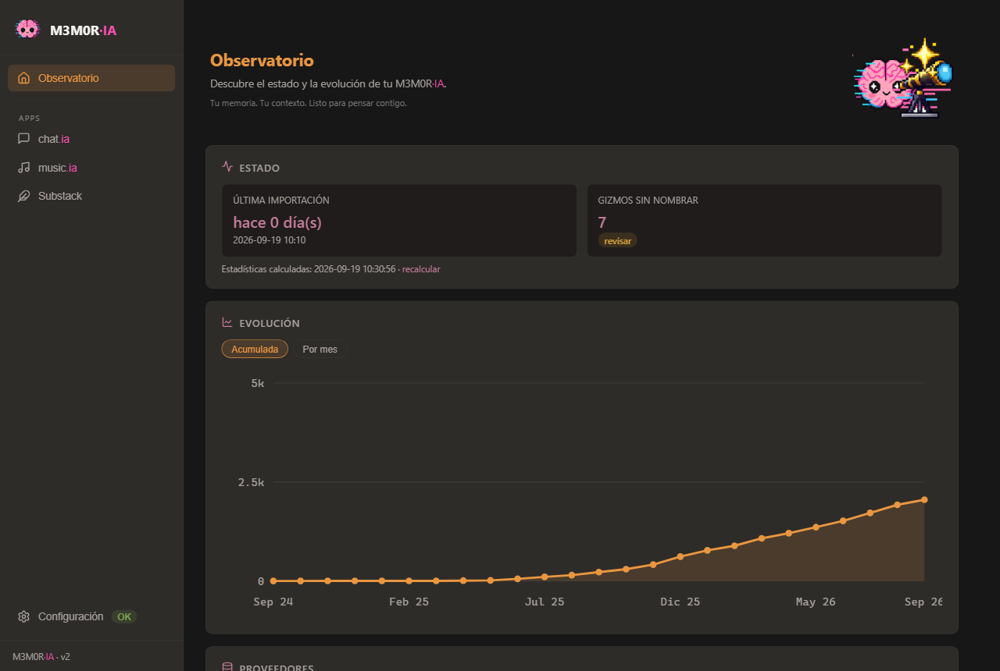
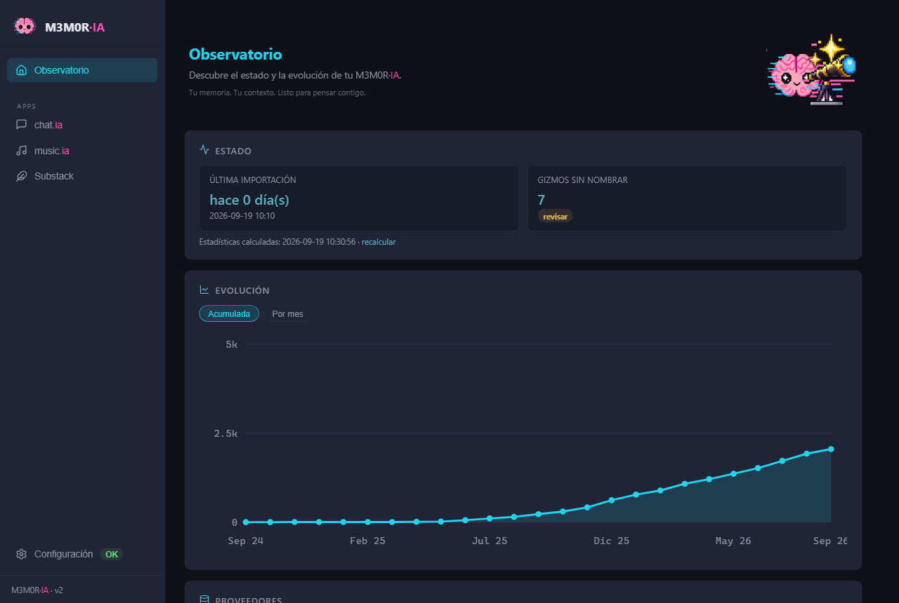
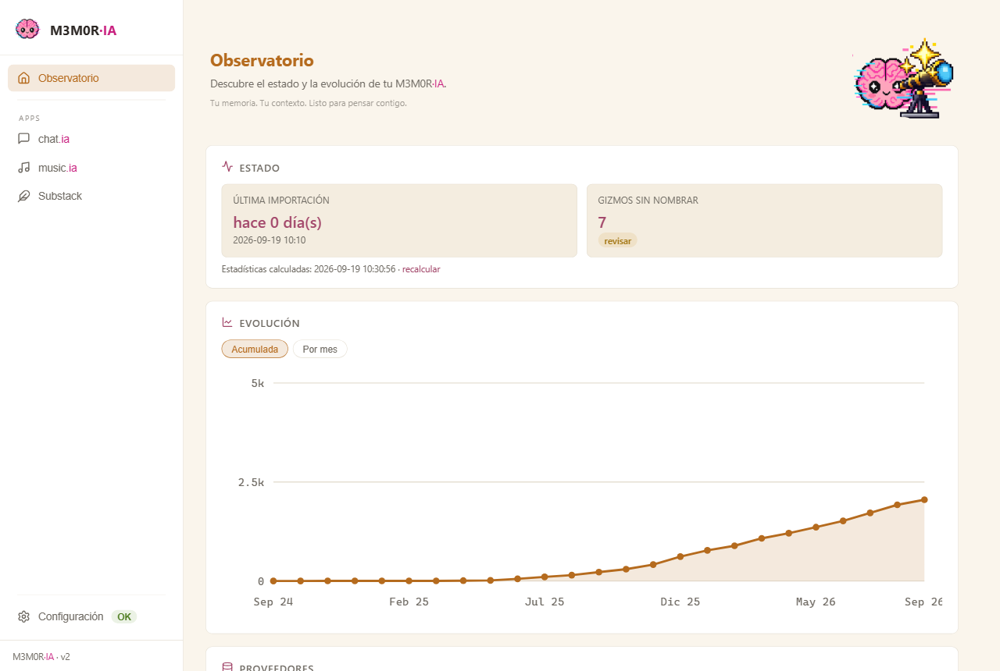

# M3M0R·IA (MemorIA2GO)

<p align="center">
  
</p>

> **Nuestra memoria ya no vive en un solo sitio.**
> 
> Está repartida entre las conversaciones en las que pensamos, los textos que publicamos y la música que compusimos — en servidores que no son nuestros, que pueden cerrar, cambiar de dueño o dejar de guardarla.
> 
> **M3M0R·IA la trae de vuelta.** A tu disco, en Markdown, tuya.

[](https://www.python.org/downloads/)
[](https://creativecommons.org/licenses/by-nc-sa/4.0/)

### ⬇ **[Descargar M3M0R·IA para Windows](https://github.com/V0raOnline/MemorIA2GO/releases/download/v3.0.0-es/M3M0R-IA-3.0.0-es.zip)** · 21 MB

Descomprimes y haces doble clic. **No hace falta saber programar ni instalar
nada** — lleva su propio Python dentro. Los detalles, en *Instalación — el
paquete de Windows*, más abajo; el histórico, en
**[Releases](https://github.com/V0raOnline/MemorIA2GO/releases)**.

---

## ¿Qué es M3M0R·IA?

No es simplemente un conversor de exports. Es el lugar donde recuperas el conocimiento y creaciones que dejaste repartidas.

Son **tres herramientas conviviendo en la misma casa**, con pipelines distintos a propósito: una conversación, un artículo y una canción no son la misma cosa, y tratarlas igual las estropea a las tres.

El pacto es el mismo para las tres: **nada se pierde.** Nunca se borra nada, los originales mandan sobre lo que se genera, y lo que la herramienta no sabe leer lo dice en voz alta en vez de inventárselo.

| Lo que tienes fuera    | De dónde                | A dónde llega                                                                                                              |
| ---------------------- | ----------------------- | -------------------------------------------------------------------------------------------------------------------------- |
| **Tus conversaciones** | ChatGPT · Claude · Grok | un vault navegable en Obsidian, organizado por proyecto y fecha, listo para servir de contexto vía MCP o trazar conexiones |
| **Lo que publicaste**  | Substack                | **Tintero** — tu archivo editorial, distingue publicado, retirado y borrador                                               |
| **Lo que compusiste**  | Suno · Flow Music       | **MUSIC·0LOGY** — con el linaje entre versiones, covers y remezclas resuelto como enlaces                                  |

No hace falta usarlas todas. Cada una funciona por separado, y sin configuración no aparecen.

A diferencia de las herramientas genéricas de migración, que solo transfieren memorias guardadas, M3M0R·IA trae **el historial completo**: deduplicado, fusionado, con las imágenes y los adjuntos extraídos a sus propios bancos, y con índices de navegación generados. Los proveedores se reconocen por la estructura interna de su export, nunca por el nombre del archivo.

Las conversaciones de los tres proveedores conviven en un único vault fusionado; cada nota lleva `provider` y `source` en su frontmatter, así que puedes filtrar, colorear e indexar por origen y recorrer un hilo de pensamiento completo. Tintero y MUSIC·0LOGY construyen sus propios vaults: no tenía sentido tratar igual un archivo editorial que una biblioteca musical.

### Novedad — Nuevo formato de export de Claude (2026-09+)

Anthropic cambió en silencio el formato del export de Claude en septiembre
de 2026: ya no es un único ZIP con `conversations.json` + `users.json` +
`projects.json`, sino un **manifiesto JSON + cinco ZIPs de un solo uso**,
uno por categoría: `light_metadata`, `projects`, `memories`, `frames` y
`conversations`. Sin nota en el changelog, sin aviso en el centro de
ayuda; la única señal pública es un [issue abierto de
terceros](https://github.com/ukogan/claude-migration-assistant/issues/4)
de gente sorprendida por el cambio.

M3M0R·IA reconoce el formato nuevo y aprovecha lo que trae que el viejo
no traía:

- **`memories`** → un vault nuevo `Claude_Mem/` (hermano de MERGED_VAULT y
  PRJ_VAULT). Contiene el dossier personal que Claude ha acumulado sobre
  ti, los resúmenes textuales por proyecto, y las **notas de memoria
  persistente** que Claude usa internamente — 71 ficheros con estructura
  jerárquica `/areas /people /projects /topics /profile.md` que se
  respeta tal cual, porque la estructura ES información.
- **`frames`** (los artifacts) → `MERGED_VAULT/CLAUDE_WEB/FRAMES/` con
  **historial de versiones y comentarios**. El export viejo perdía las
  revisiones intermedias; el nuevo trae cada versión con su timestamp,
  descripción y HTML íntegro, y M3M0R·IA los copia tal cual junto a una
  nota-índice que rescata también los hilos de comentarios.
- **`projects`** → nota-índice por proyecto en `PRJ_VAULT/<name>/` con
  `description`, `prompt_template` (system prompt del proyecto),
  metadatos y `_docs/` con el project knowledge que subiste inline.
- **`conversations`** → forma interna idéntica al export viejo, mismo
  adaptador. Las conversaciones que también aparecían en un export
  anterior **no se duplican**: `vault_merge` las agrupa por `conv_id` y
  fusiona lo que sea nuevo en el hilo. Solo cambia el empaquetado.

Se ingesta desde la carpeta descomprimida (los cinco ZIPs se pueden dejar
sueltos en `exports_dir` o dentro de una carpeta hermana). El manifiesto
JSON se reconoce pero no se importa por sí solo — es solo un índice.
`light_metadata` se conserva pero no se ingesta (metadatos de cuenta, sin
valor para el vault).

¿Prefieres verlo funcionando antes de instalar nada? **[Test de recuperación de extracto conversacional](https://v0raonline.substack.com/p/test-de-recuperacion-de-extracto)** — una demostración con capturas, redactada como informe clínico por una institución que estudia a los organismos biológicos y su incapacidad para encontrar sus propias conversaciones.

Y **no olvides descargar tu diploma** cuando completes tu primera extracción con éxito. Consta en acta.

¿Quieres saber cómo funciona cada flujo por dentro, qué hace cada adaptador y por qué las hermanas no son "un proveedor más"? Está todo en **[ARCHITECTURE.md](ARCHITECTURE.md)**.

### Refresh visual — tres temas de color (2026-09)

La interfaz web se rediseñó para ofrecer **tres temas de color
elegibles desde Configuración → Apariencia**, con el mismo patrón de
roles cromáticos en los tres: magenta = identidad, ámbar/cian =
acción, rosa/apagado = indicador. El cambio se aplica al instante y
persiste en `memoria_config.yaml`.

<table>
  <tr>
    <td width="33%" align="center"><br><sub><b>warm</b> — cálido (por defecto)</sub></td>
    <td width="33%" align="center"><br><sub><b>cool</b> — frío</sub></td>
    <td width="33%" align="center"><br><sub><b>claro</b> — luz de mañana</sub></td>
  </tr>
</table>

Los roles cromáticos se mantienen entre los tres para que la interfaz
lea como la misma casa en distinto registro:

- **Identidad — magenta.** El wordmark `M3M0R·IA` y sus ecos
  (`.brand-ia`). Aparece poco, y por eso pesa. Único elemento que no
  cambia de color entre los tres temas oscuros (en claro se oscurece
  a `#c81e7e` para pasar contraste).
- **Acción — ámbar en warm/claro, cian en cool.** Pestaña activa,
  cabecera de sección, botón primario, borde de foco, línea del chart.
- **Indicador — rosa palo en warm, cian apagado en cool, rosa vino en
  claro.** Stats, hovers, enlaces. Misma familia que la marca pero un
  stop más apagado para no competir con el wordmark.
- **Neutros** — stone cálidos en warm (`#171717 / #2e2c29 / #1f1c1b`),
  gris con tinte azul en cool (`#0F1117 / #202436 / #181C2A`), crema y
  blanco en claro (`#faf5ec / #ffffff / #f4ede0`).

El pipeline no cambia — es solo CSS + un campo `options.theme` en
`memoria_config.yaml`.

---

## Ediciones por idioma

M3M0R·IA se mantiene como dos líneas de producto en paralelo, una por idioma. Las dos están completas y son equivalentes — elige rama al clonar:

- **`release/es` (esta rama) — edición española.** Interfaz, mensajes de ejecución y contenido del vault, todo en español.
- **`release/en` — edición inglesa.** Completa y equivalente: interfaz (`i18n-web`), mensajes de ejecución (`i18n-runtime`) y contenido escrito en el vault, nombres de carpeta incluidos (`i18n-content`).
- **`main`** está congelada en el último estado común (v2.8.0) como referencia inmutable. Las correcciones entran por `release/es` y se llevan a `release/en`, así que las dos líneas avanzan a la par.

---

## Requisitos

**Si usas el paquete de Windows, ninguno.** Lleva su propio Python dentro.

- **Obsidian**, para navegar el resultado. Y opcionalmente Claude Desktop con un servidor MCP de filesystem, si quieres usar tu vault como contexto vivo.

Si prefieres correrlo desde el código, entonces sí: Python **3.10+** y `pip install -r requirements.txt` (beautifulsoup4, lxml, rich, pyyaml, flask, requests). Para el suite de tests, `pip install -r requirements-dev.txt && python -m pytest tests/`.

Desarrollado y probado a fondo en Windows; el pipeline en sí es multiplataforma.

---

## Arranque rápido (interfaz web)

M3M0R·IA viene con una interfaz web local de siete secciones: Observatorio, Configuración, Verificación, Construcción, Cartografía, Reconexión para las conversaciones, MUSIC·0LOGY y Tintero como herramientas con entidad propia, dentro de la misma casa.

### Paso 0: consigue tu material

Esto empieza **fuera** de la herramienta, y es lo único que no puede hacer por ti. Solo necesitas traer las fuentes que vayas a usar:

| De dónde                                | Cómo se consigue                                                                                                                                                        |
| --------------------------------------- | ----------------------------------------------------------------------------------------------------------------------------------------------------------------------- |
| **ChatGPT**                             | Configuración → Controles de datos → Exportar datos. Llega un ZIP por email                                                                                             |
| **Claude**                              | Configuración → Privacidad → Exportar datos. Llega por email. Desde 2026-09 el export nuevo son **cinco ZIPs de un solo uso** (`conversations`, `projects`, `memories`, `frames`, `light_metadata`) descritos por un manifiesto JSON — se descargan todos a la carpeta de exports; el formato viejo (un ZIP único) sigue funcionando. Ver la sección *Novedad* arriba |
| **Grok**                                | Configuración → Datos → Descarga tus datos. El export incluye conversaciones y una parte de tus generaciones de Imagine; algunas llegan solo como enlace y M3M0R·IA las descarga aparte con la herramienta de pendientes (pestaña Reconexión) |
| **Substack**                            | Panel de control → Configuración → Importar/exportar                                                                                                                    |
| **Substack**, estadísticas *(opcional)* | Panel de control → Estadísticas → Publicaciones → Mostrar, **marcando todas las columnas**, y descargar el CSV                                                          |
| **Suno · Flow Music**                   | No hay export: la biblioteca se descarga desde la herramienta a través de su API con un token que copias del navegador — ver **[ME_HE_ATASCADO.md](ME_HE_ATASCADO.md)** |
| **Claude Code · Codex** *(sesiones)*    | No hay que traer nada: las sesiones de agente ya viven en tu disco (`~/.claude/projects`, `~/.codex/sessions`) y ningún export de cuenta las incluye. Se ingieren directamente desde la pestaña Reconexión |

Los ZIP se sueltan **tal cual, sin descomprimir**, en la carpeta que configures como `exports_dir`. El de Substack va a esa misma carpeta: el pipeline de conversaciones lo reconoce y lo rechaza, y Tintero lo recoge de ahí. Una carpeta, dos puertas.

**No borres los zip.** Son la fuente original y la única copia completa de lo que te dio cada plataforma: siempre estamos buscando cómo extraer más información de ellos, así que conservarlos te deja reprocesarlos para ampliar tu m3m0rIA a medida que la herramienta aprende a leer más. Y si actualizas M3M0R·IA, tener los zip te permite reconstruir el vault desde cero con la versión nueva, sin depender de lo que quedó escrito con la vieja.

El CSV de estadísticas es opcional, pero es la única fuente en la que están la **sección** y las **etiquetas** de cada post — sin él Tintero construye el vault funcional, solo que sin taxonomía. **Hay que marcar todas las columnas al pedirlo:** si se descarga solo con las de por defecto, esos dos campos no viajan.

### Instalación — el paquete de Windows

**Si no has abierto una consola en tu vida, este es tu camino.** Descarga
**[`M3M0R-IA-3.0.0-es.zip`](https://github.com/V0raOnline/MemorIA2GO/releases/download/v3.0.0-es/M3M0R-IA-3.0.0-es.zip)**
(21 MB), descomprímelo donde quieras y haz doble clic en **`M3M0R-IA.bat`**.
Ya está: se abre tu navegador con M3M0R·IA dentro.

> **Un paso antes de descomprimir, y te ahorra un susto.** Windows marca todo
> lo que llega de internet. Haz **clic derecho en el zip → Propiedades →**
> marca **Desbloquear → Aceptar**, y luego descomprime.
>
> Si no lo haces no pasa nada malo, pero la marca se copia a los más de dos
> mil ficheros de dentro, y al pulsar el `.bat` Windows avisará de que no
> puede verificar quién creó este archivo. Es verdad: el paquete no va
> firmado, firmar cuesta dinero y esto es software libre. Desbloquear el zip
> antes evita esa pantalla por completo.

Lleva su propio Python, así que **no instala nada en tu sistema** — no puede
romperte nada que ya tuvieras funcionando, no te pide permisos de
administrador, y se desinstala arrastrando la carpeta a la papelera. Al
arrancar por primera vez se crea un acceso directo con icono al lado, para
que puedas anclarlo o llevártelo al escritorio.

La primera pantalla te dirá que falta configurar la carpeta base. Eso se
hace en la pestaña **Configuración**, con un explorador de rutas; no hay que
editar ningún fichero a mano.

### Instalación — desde el código

Para quien vaya a tocarlo, o no esté en Windows:

```bash
git clone <este repo>
cd MemorIA2GO
pip install -r requirements.txt

# 1. Crea tu configuración desde la plantilla y ajusta tus rutas
copy memoria_config.yaml.example memoria_config.yaml   # Windows
cp memoria_config.yaml.example memoria_config.yaml     # Linux / macOS

# 2. Arranca
python launcher.py     # en Linux, según tu distro: python3 launcher.py
```

Tu navegador se abre en `http://127.0.0.1:8765`. El servidor solo escucha en localhost — no tiene autenticación y puede lanzar el pipeline, así que déjalo así.

#### URL bonita (opcional)

Si te cansa escribir la dirección con el puerto, añade esta línea a tu fichero hosts (Windows: `C:\Windows\System32\drivers\etc\hosts`; Linux/macOS: `/etc/hosts`, con `sudo`):

```
127.0.0.1  m3m0ria
```

Y arranca en el puerto 80:

```bash
python launcher.py --port 80 --no-browser
```

Ya puedes entrar escribiendo `http://m3m0ria/`. El `--no-browser` está ahí porque en este modo lo normal es dejarlo corriendo de fondo: en Windows, con una tarea programada de inicio de sesión que lance `pythonw launcher.py --port 80 --no-browser`; en Linux, con un servicio de usuario de systemd. Ojo: en Linux el puerto 80 pide privilegios — quédate en el 8765 o pon un proxy delante.

La primera carga del dashboard calcula las estadísticas y las cachea junto a tu vault (`.m3m0ria_stats.json`); después de eso, las cargas son instantáneas. El pipeline refresca la caché al final del paso 4, y el dashboard ofrece un enlace manual de *recalcular*.

### Construir el paquete (solo si mantienes esto)

```bash
python installer/build.py
```

Descarga el Python embebido de python.org y comprueba **su MD5 publicado y un SHA-256 fijado** antes de descomprimirlo: lo que entra ahí acaba ejecutándose en el ordenador de otra persona. Antes de comprimir barre el
resultado y se planta si encuentra rutas de la máquina que construye — un
paquete con rutas absolutas dentro no arranca en ningún otro sitio, y eso ya
pasó una vez.

Hay dos bancos de pruebas para lo que solo falla en una instalación nueva:

```bash
python installer/prueba_instalacion_nueva.py   # la API en los 4 estados de arranque
python installer/prueba_botones.py             # los POST con cuerpos vacíos y rotos
```

### CLI (sin web)

Puedes ejecutar todo desde una terminal de comandos. Sin servidor web.

```bash
python MemorIA2GO.py                  # interactivo, pipeline completo
python MemorIA2GO.py --reprocess-all  # re-parsea todos los exports válidos desde cero
```

---

> ### ¿Te has atascado?
> 
> Si nunca has usado una terminal, o no sabes lo que es un token, sigue aquí: **[ME_HE_ATASCADO.md](ME_HE_ATASCADO.md)** lo cuenta desde cero, sin dar nada por sabido.

## Configuración

- `memoria_config.yaml` — tus rutas (vault base, carpeta de exports, mapa de gizmos) y opciones (carpetas por año/mes, generación de índice). Se crea desde `memoria_config.yaml.example`; nunca se commitea.
- `gizmo_map.json` — mapea IDs de proyecto (gizmo) de ChatGPT a nombres humanos. Se cura desde la interfaz web (pestaña Cartografía); nunca se commitea.
- `topic_map.json` — tus temas para conversaciones sin asignar: `{"tema": ["palabras", "frases", "campo=valor"]}`. Se cura desde la interfaz; genera notas de índice enlazadas en `MERGED_VAULT/_Temas`. Nunca se commitea.
- `substack_vault` (en `memoria_config.yaml`) — dónde se construye el vault de Tintero. Es la **única** ruta que necesita: el export de Substack y su CSV de estadísticas viven en tu carpeta de exports de siempre, porque el pipeline de conversaciones los rechaza y Tintero los recoge de ahí. Una carpeta, dos puertas.
- `suno_backup` / `suno_vault` y `flowmusic_backup` / `flowmusic_vault` (en `memoria_config.yaml`) — las rutas de MUSIC·0LOGY, un par por fuente: dónde vive el backup crudo y dónde se construye su vault de Obsidian. Las cuatro opcionales e independientes: puedes usar una fuente, las dos o ninguna. Sin el backup configurado, la tarjeta del Observatorio de esa fuente simplemente no aparece — no se pinta a cero, porque decir "0 pistas" sobre una biblioteca que no has descargado es mentir, no informar.

Los exports de Claude y Grok no enlazan conversaciones a proyectos: esas notas se organizan por temas (varios-a-varios), no por carpetas. **Claude sí trae los proyectos como entidades propias desde el formato nuevo** (2026-09+): cada proyecto tiene su carpeta en `PRJ_VAULT/<name>/` con metadatos y project knowledge, aunque las conversaciones siguen sin poder vincularse a ellos automáticamente por falta de puente en el export.

---

## La documentación, por preguntas

Cada documento responde **una** pregunta. Si buscas algo que no está aquí, probablemente esté en otro:

|                                            | Responde                                 |
| ------------------------------------------ | ---------------------------------------- |
| **README** (estás aquí)                    | ¿Qué es y cómo lo arranco?               |
| **[ARCHITECTURE.md](ARCHITECTURE.md)**     | ¿Cómo funciona por dentro y por qué así? |
| **[ME_HE_ATASCADO.md](ME_HE_ATASCADO.md)** | ¿Y si no sé nada de esto?                |
| **[DEVLOG.md](DEVLOG.md)**                 | ¿Qué aprendimos construyéndolo?          |

---

## Roadmap

- **Biblioteca de Imagine (Grok) como herramienta hermana**, al estilo de MUSIC·0LOGY: traer las generaciones que el export no incluye, directamente desde tu biblioteca, con el linaje entre una imagen y sus ediciones resuelto como enlaces. Ya funciona para uso propio; pendiente de integrar en la interfaz.
- Selector manual conversación↔proyecto para casos residuales (namespace `manual:` en gizmo_map, diseñado y diferido hasta que el montón de conversaciones sin asignar se reduzca más)
- Extracción de assets para los adjuntos `.dat` del export fragmentado de ChatGPT 2026+ (un formato binario distinto al ya soportado)
- Distinguir "nunca tuvo proyecto" de "tiene un proyecto que nadie ha nombrado todavía" en `Project_name` — hoy ambos colapsan a `none`

---

## Licencia

CC BY-NC-SA 4.0 — ver el badge de arriba.
